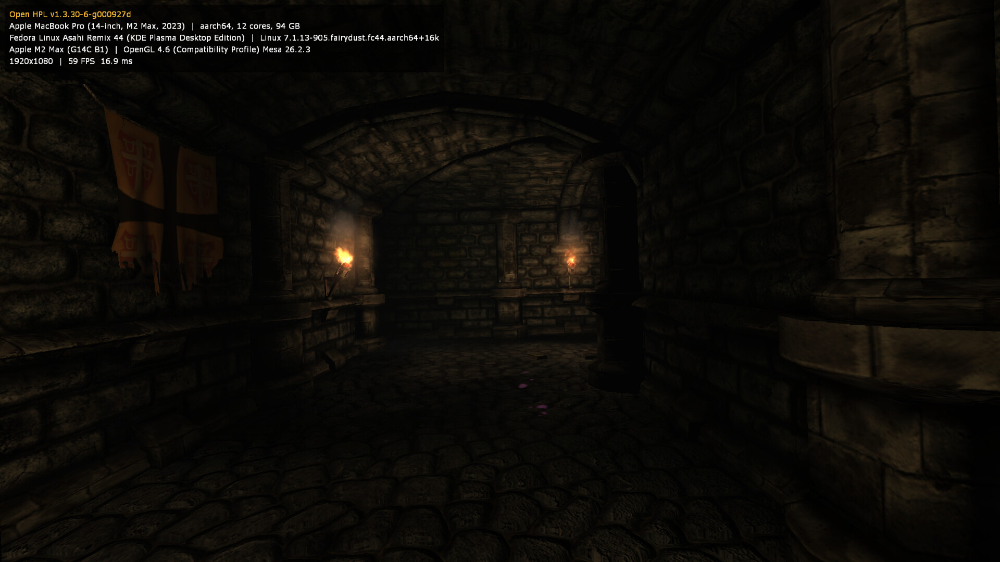
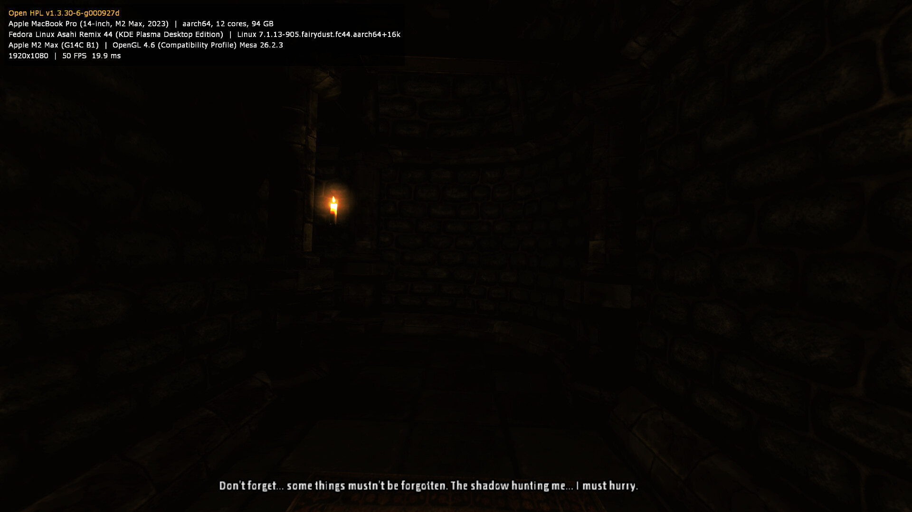
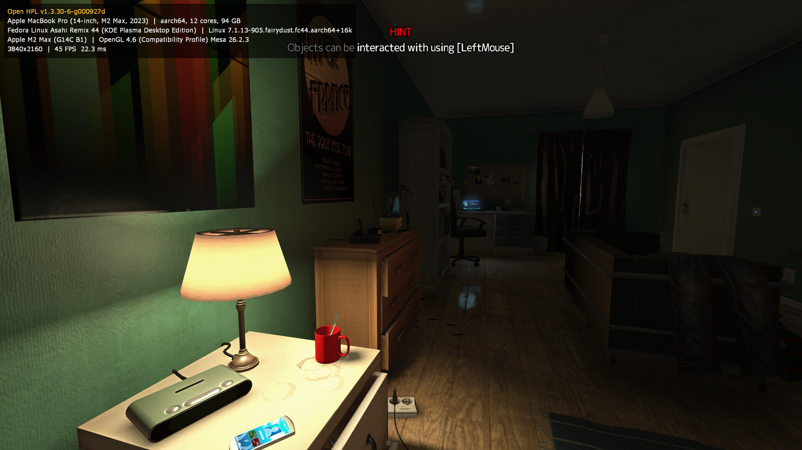
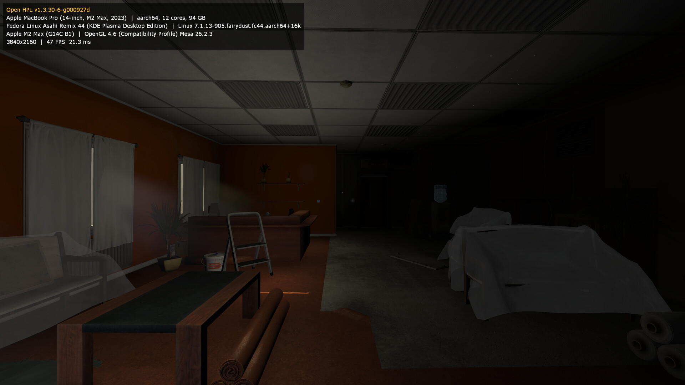
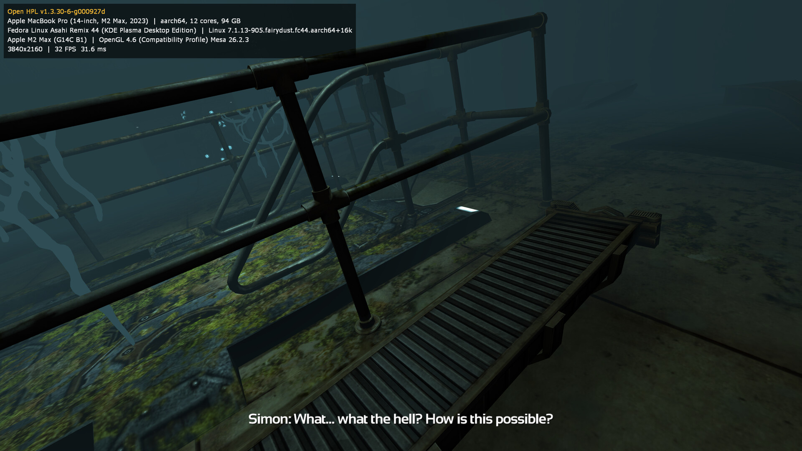

Open HPL
========

An aarch64 Linux port of the HPL2 engine and *Amnesia: The Dark Descent*,
open-sourced by [Frictional Games](https://www.frictionalgames.com/) under
the GPLv3. Unofficial, not affiliated with or endorsed by Frictional Games.

Game data (maps, textures, audio) is not included — you need a legitimate
copy of the game to actually play. Game installs are only read: the engine
mounts Steam libraries read-only for itself, and settings, saves, caches and
logs go to the XDG base directories.

Screenshots
-----------
Dev HUD on (`OPENHPL_DEV_HUD=1`).

What changed from upstream
---------------------------
The original codebase only targeted 32-bit x86 Linux, Windows, and
PowerPC-era macOS. This port:

- Replaces bundled 32-bit x86 third-party libraries with native aarch64
  system packages.
- Builds Newton Dynamics 2.36 from source (ScummVM's copy), the version SOMA
  and Rebirth ship.
- Upgrades AngelScript to 2.38 for aarch64 calling-convention support.
- Drops the x86-only FBX mesh loader (unused — shipped content uses
  Collada/`.msh`).
- Fixes assorted portability/correctness bugs found while running the port
  against real game data — see [PORTING_NOTES.md](PORTING_NOTES.md).

Scope is the engine, game, and launcher. Upstream's editor tools and
Windows/macOS build files are dropped.

Building
--------
CMake project files are in `amnesia/src/`.

License
-------
GPLv3 unless noted otherwise — see [LICENSE](LICENSE) and
[THIRD_PARTY_LICENSES.md](THIRD_PARTY_LICENSES.md) for vendored
third-party code.
